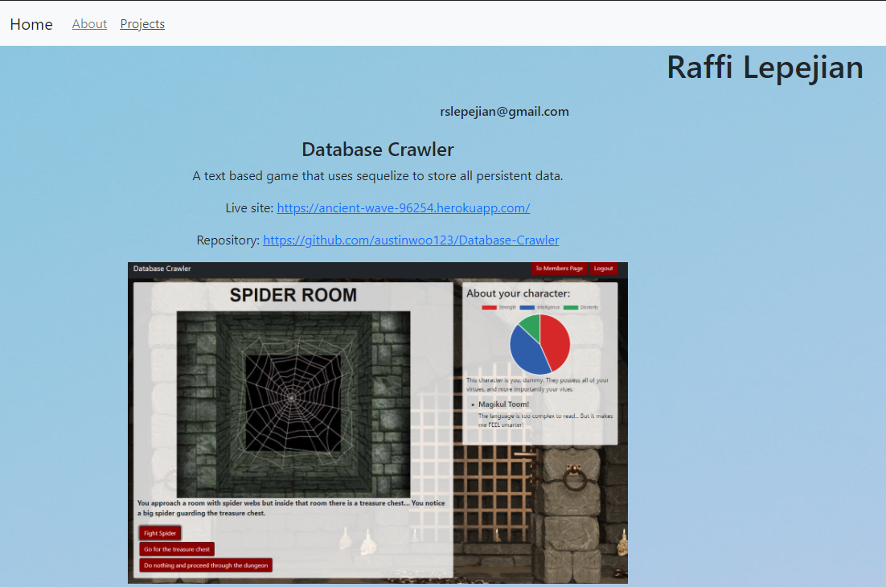

# Employee Directory

## Description
This is a personal portfolio built using react. It showcases some of my recent projects.

## Built With

* [HTML](https://developer.mozilla.org/en-US/docs/Web/HTML)
* [CSS](https://developer.mozilla.org/en-US/docs/Web/CSS)
* [JS](https://www.javascript.com/)
* [GitHub](https://github.com/)
* [Git](https://git-scm.com/)
* [node.js](https://nodejs.org/en/)
* [npm](https://www.npmjs.com/)
* [Reactjs](https://reactjs.org/)
* [Bootstrap](https://getbootstrap.com/)

## Deployed Link

* [See Live Site](https://rslepejian.github.io/react-portfolio/#/)

## Preview of Working Site



## Code Snippet
This code snippet shows the router and basic structure used to construct this portfolio. It uses 3 paths as well as a catch all path that sends users back to the homepage.

```javascript
function App() {
  return (
    <Router basename="/">
      <div id="all">
        <NavTabs />
        <Header />
        <Switch>
          <Route exact path="/" component={Home} />
          <Route exact path="/projects" component={Projects} />
          <Route exact path="/about" component={About} />
          <Route component={Home} />
        </Switch>
        <Footer />

      </div>
    </Router >
  );
}
```

## Authors

* **Raffi Lepejian** 

## Contact Information

- [Link to Portfolio Site](https://rslepejian.github.io/react-portfolio/#/)
- [Link to Github](https://github.com/rslepejian)
- [Link to LinkedIn](https://linkedin.com/in/raffi-lepejian-071876153)